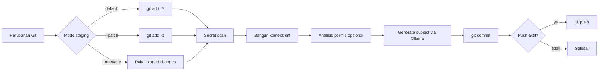

<div align="center">

# Git Auto Commit Ollama

[](https://github.com/aibersemi/git-auto-commit-ollama/actions/workflows/ci.yml)


</div>

CLI Bash untuk membuat commit message Git secara otomatis dengan Ollama.

`git-ai` membantu workflow commit harian: staging perubahan, membaca konteks diff, meminta model Ollama membuat subject commit satu baris, lalu commit dan push. Tool ini cocok untuk server, workstation, atau repo internal yang ingin commit message tetap ringkas tanpa mengirim kode ke layanan AI eksternal.

## Table of Contents

- [Features](#features)
- [How It Works](#how-it-works)
- [Prerequisites](#prerequisites)
- [Installation](#installation)
- [Configuration](#configuration)
- [Usage](#usage)
- [Security](SECURITY.md)
- [Troubleshooting](#troubleshooting)
- [Development](#development)
- [Repository Structure](#repository-structure)
- [License](#license)

## Features

- Auto stage perubahan dengan `git add -A`, atau staging interaktif via `git add -p`.
- Generate commit subject satu baris melalui Ollama `/api/chat`.
- Structured output JSON Schema untuk hasil commit message yang lebih stabil.
- Analisis per-file opsional supaya prompt tetap fokus pada perubahan penting.
- Safe mode saat pola sensitif terdeteksi, sehingga diff detail tidak dikirim ke model.
- Secret guard untuk staged changes, dengan dukungan tambahan `gitleaks` jika tersedia.
- Auto-push ke remote upstream, atau set upstream pertama kali jika belum ada.
- Dry-run untuk melihat commit message tanpa mengubah Git state.
- Lock per repository agar dua proses `git-ai` tidak berjalan bersamaan.
- CI GitHub Actions untuk validasi syntax Bash, ShellCheck, dan output help.

## How It Works



Commit message yang dibuat sengaja dibatasi menjadi subject satu baris tanpa body dan footer. Batas panjang default subject adalah `120` karakter.

## Prerequisites

Wajib tersedia di mesin yang menjalankan CLI:

- `bash`
- `git`
- `curl`
- `jq`
- `flock` dari paket `util-linux`
- Ollama server yang bisa diakses dari host ini

Opsional:

- `ollama` CLI, dipakai untuk auto-pull model jika model default belum ada.
- `gitleaks`, dipakai sebagai scanner tambahan untuk staged secrets.
- `shellcheck`, dipakai untuk validasi saat development.

Contoh instalasi dependensi di Ubuntu/Debian:

```bash
sudo apt-get update
sudo apt-get install -y git curl jq util-linux shellcheck
```

Pastikan Ollama berjalan dan model default tersedia:

```bash
ollama serve
ollama pull gemma4:e4b
```

## Installation

Clone repository:

```bash
git clone git@github.com:aibersemi/git-auto-commit-ollama.git
cd git-auto-commit-ollama
```

Install command `git-ai` ke `/usr/local/bin`:

```bash
make install
```

Gunakan `PREFIX` jika ingin memasang ke lokasi lain:

```bash
make install PREFIX="$HOME/.local"
```

Setelah install, command tersedia dari direktori mana pun:

```bash
git-ai --version
git-ai --help
```

Uninstall:

```bash
make uninstall
```

## Configuration

Konfigurasi utama ada di [`git-ai.conf`](git-ai.conf). File ini berada satu folder dengan executable atau symlink `git-ai`, dan akan dibaca otomatis saat CLI dijalankan.

Nilai default saat ini:

| Variabel | Default | Fungsi |
| --- | --- | --- |
| `DEFAULT_MODEL` | `gemma4:e4b` | Model Ollama yang selalu dipakai. |
| `DEFAULT_OLLAMA_HOST` | `http://127.0.0.1:11434` | Host utama Ollama. |
| `FALLBACK_OLLAMA_HOST` | `http://10.50.0.2:11434` | Host cadangan jika host utama tidak bisa diakses. |
| `DEFAULT_DO_PUSH` | `1` | Push otomatis setelah commit. |
| `AI_TEMPERATURE` | `0.2` | Temperatur request ke model. |
| `AI_THINK` | `false` | Opsi thinking Ollama: `false`, `true`, `low`, `medium`, atau `high`. |
| `AI_NUM_PREDICT` | `2048` | Token output request utama. |
| `AI_MAX_NUM_PREDICT` | `2048` | Batas maksimum `num_predict`. |
| `MAX_SUBJECT_LENGTH` | `120` | Panjang maksimal subject commit. |
| `FILE_ANALYSIS_LIMIT` | `6` | Batas jumlah file untuk analisis per-file. |
| `FILE_ANALYSIS_PARALLELISM` | `4` | Jumlah request analisis file paralel. |
| `FILE_ANALYSIS_NUM_PREDICT_PER_FILE` | `512` | Token output untuk analisis per-file. |
| `MAX_FILES_LIST` | `20` | Batas jumlah file dalam konteks nama/status Git. |
| `TOP_FILES` | `4` | Jumlah file terbesar untuk ringkasan hunk. |
| `MAX_HUNK_CHARS` | `1000` | Batas karakter hunk per file. |
| `MAX_TOTAL_HUNKS_CHARS` | `3500` | Batas total karakter hunk yang dikirim ke AI. |

Jika `DEFAULT_OLLAMA_HOST` dikosongkan, script akan mencoba membaca `OLLAMA_HOST` dari:

```text
/etc/systemd/system/ollama.service
```

Jangan menyimpan secret di `git-ai.conf`.

## Usage

Jalankan dari dalam repository Git yang memiliki perubahan:

```bash
git-ai
```

Perintah default akan:

1. menjalankan `git add -A`;
2. memindai potensi secret;
3. membuat commit message dengan Ollama;
4. menjalankan `git commit`;
5. menjalankan `git push` jika `DEFAULT_DO_PUSH=1`.

Contoh workflow umum:

```bash
# Commit tanpa push
git-ai --no-push

# Staging interaktif
git-ai --patch

# Review atau edit commit message sebelum commit
git-ai --interactive

# Pakai staged changes yang sudah ada
git add git-ai.sh git-ai.conf
git-ai --no-stage

# Lihat commit message tanpa commit atau push
git-ai --dry-run

# Tampilkan status Git saja
git-ai --status
```

Opsi lanjutan:

```bash
# Matikan analisis per-file agar lebih cepat
git-ai --no-file-analysis

# Batasi analisis per-file ke 3 file
git-ai --file-analysis-limit 3

# Ubah paralelisme analisis per-file
git-ai --file-analysis-parallelism 2

# Matikan structured output dan pakai fallback plain text
git-ai --no-structured

# Jangan auto-pull model jika belum tersedia
git-ai --no-pull

# Jalankan commit tanpa Git hooks
git-ai --no-verify

# Tampilkan log debug
git-ai --debug
```

## Troubleshooting

| Masalah | Penyebab umum | Solusi |
| --- | --- | --- |
| `Ollama tidak dapat diakses` | Service mati atau host salah. | Jalankan `ollama serve`, cek `DEFAULT_OLLAMA_HOST`, atau isi `FALLBACK_OLLAMA_HOST`. |
| `Model DEFAULT_MODEL tidak ditemukan` | Model belum ada di server Ollama. | Jalankan `ollama pull gemma4:e4b` atau ubah `DEFAULT_MODEL`. |
| `--no-stage, tapi belum ada staged changes` | Belum menjalankan `git add`. | Stage file lebih dulu, lalu ulangi `git-ai --no-stage`. |
| Commit dibatalkan karena secret | Scanner menemukan potensi credential. | Hapus secret dari staged changes, lalu ulangi commit. |
| Hook Git menggagalkan commit | Pre-commit/pre-push hook gagal. | Perbaiki temuan hook, atau gunakan `--no-verify` jika memang disengaja. |
| Push gagal | Branch belum punya remote, akses SSH salah, atau remote menolak push. | Cek `git remote -v`, akses SSH, dan status branch. |

## Development

Validasi lokal:

```bash
bash -n git-ai.sh
shellcheck git-ai.sh
./git-ai.sh --help
```

CI di repository menjalankan validasi yang sama melalui GitHub Actions:

- `bash -n git-ai.sh`
- `shellcheck git-ai.sh`
- `./git-ai.sh --help`

Untuk mencoba tanpa membuat commit:

```bash
./git-ai.sh --dry-run --no-push
```

## Repository Structure

```text
.
|-- .github/workflows/ci.yml  # CI Bash validation
|-- Makefile                  # install/uninstall symlink git-ai
|-- git-ai.conf               # konfigurasi default runtime
`-- git-ai.sh                 # CLI utama
```

## License

Project ini menggunakan MIT License. Lihat [`LICENSE`](LICENSE) untuk teks lisensi lengkap.
